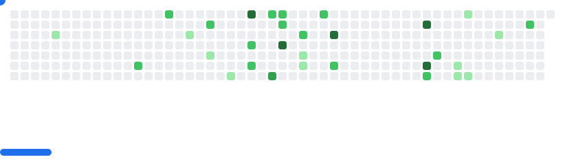

Heya! Welcome to my GitHub profile! I'm Javeen (but my real name is Nicolas), a geeky chartreux cat from Chile who loves tech, draws, codes, plays games, and more. Mrraw :3

# Languages i know
- HTML
- CSS
- JS
- Python (a bit since the last time i learned (Late 2023) TwT)

I mostly translate projects in here :P

<picture>
  <source
    media="(prefers-color-scheme: dark)"
    srcset="images/breakout-dark.svg"
  />
  <source
    media="(prefers-color-scheme: light)"
    srcset="images/breakout-light.svg"
  />
  
</picture>
<!---
nicoanimateyt/nicoanimateyt is a ✨ special ✨ repository because its `README.md` (this file) appears on your GitHub profile.
You can click the Preview link to take a look at your changes.
--->
